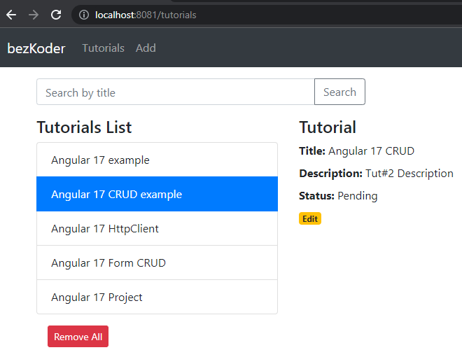

# Projeto Angular 17: Exemplo CRUD com API Rest

Construção de um aplicativo Angular 17 CRUD para consumir APIs Rest, exibir, modificar e pesquisar dados.

Aplicação de tutorial com as seguintes funcionalidades:
- Cada Tutorial possui **id, título, descrição e status de publicação**.  
- Podemos **criar, listar, atualizar e excluir** tutoriais.  
- Há uma **barra de pesquisa** para encontrar tutoriais pelo título.  



---

## 🚀 Executando o projeto
Execute o comando:  
```bash
ng serve --port 8081
Depois, acesse no navegador:
👉 http://localhost:8081/

O aplicativo será recarregado automaticamente se você alterar algum arquivo fonte.

📘 Tutorial completo

Exemplo Angular 17 CRUD com API Rest

🔎 Mais práticas com Angular 17

Exemplo de Paginação

Autenticação & Autorização com JWT

Upload de Arquivo com barra de progresso

Validação de Formulário

🟢 Fullstack com Node

Angular 17 + Node Express + MySQL

Angular 17 + Node Express + PostgreSQL

Angular 17 + Node Express + MongoDB

Upload de Arquivo com Node Express

☕ Fullstack com Spring Boot

Angular 17 + Spring Boot CRUD

Angular 17 + Spring Boot + MySQL

Angular 17 + Spring Boot + PostgreSQL

Angular 17 + Spring Boot + MongoDB

Upload de Arquivo com Angular 17 + Spring Boot

🐍 Fullstack com Django

Angular + Django CRUD

Angular + Django + MySQL

Angular + Django + PostgreSQL

Angular + Django + MongoDB

🔐 Segurança

Angular 17 + Spring Boot: Autenticação e Autorização com JWT

Angular 17 + Node.js Express: Autenticação e Autorização com JWT

☁️ Serverless com Firebase

CRUD com Firebase Realtime Database

CRUD com Firestore

Upload/Exibição/Exclusão de Arquivo com Firebase Storage

🔗 Integração (backend + frontend no mesmo servidor/porta)

Como integrar Angular com Node Restful Services

Como integrar Angular com Spring Boot Rest API

